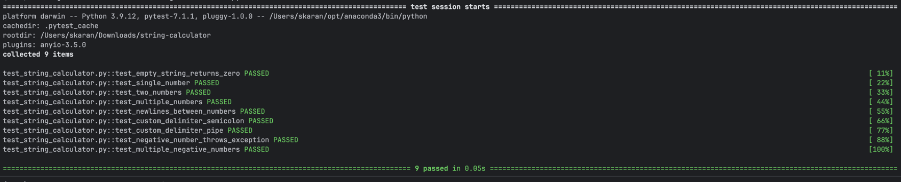

# 📘 String Calculator (TDD)

A simple string calculator that follows TDD methodology using Python.

## ✅ Features
- Handles empty strings
- Supports any number of comma-separated or newline-separated numbers
- Allows custom delimiters (e.g., `//;\n1;2`)
- Throws exceptions on negative numbers

## ▶️ How to Run
```bash
pip install pytest
pytest test_string_calculator.py
```

## 🐳 Run in Docker

You can build and run the project using Docker:

```bash
docker build -t string-calculator .
docker run --rm string-calculator
```


